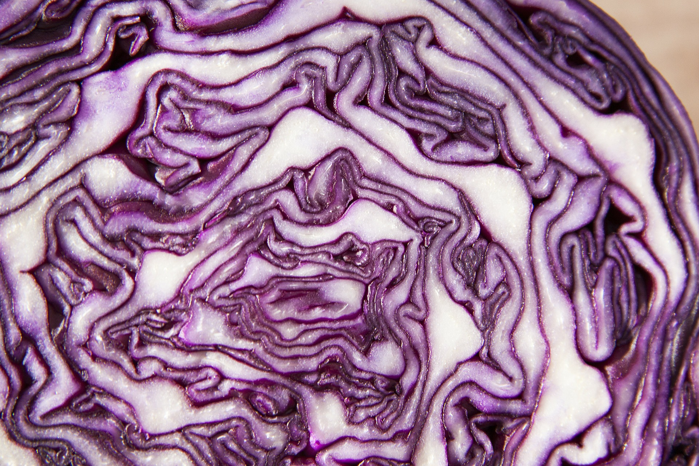
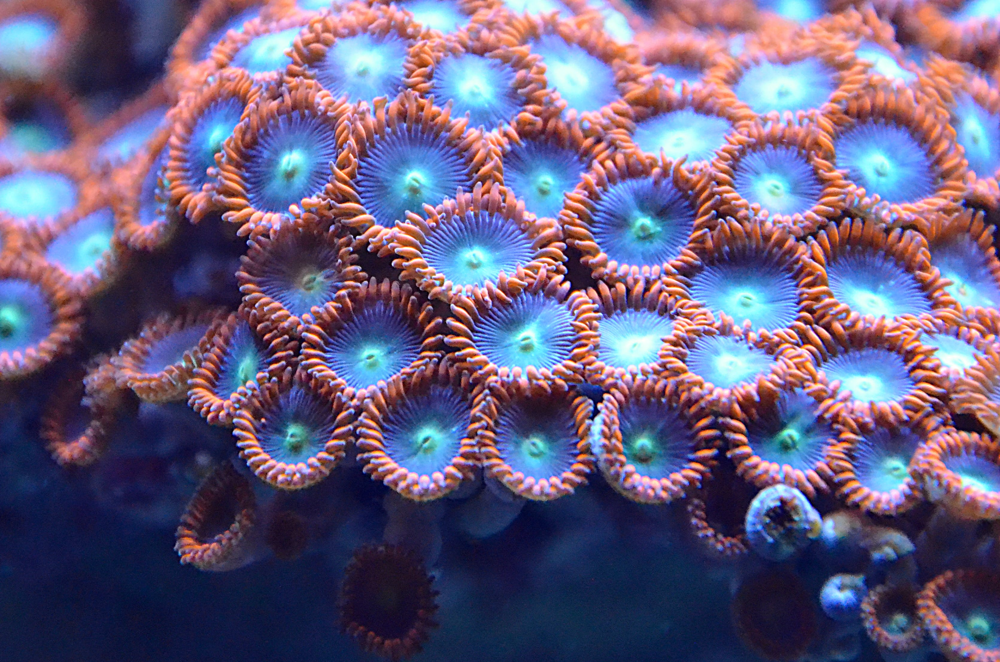
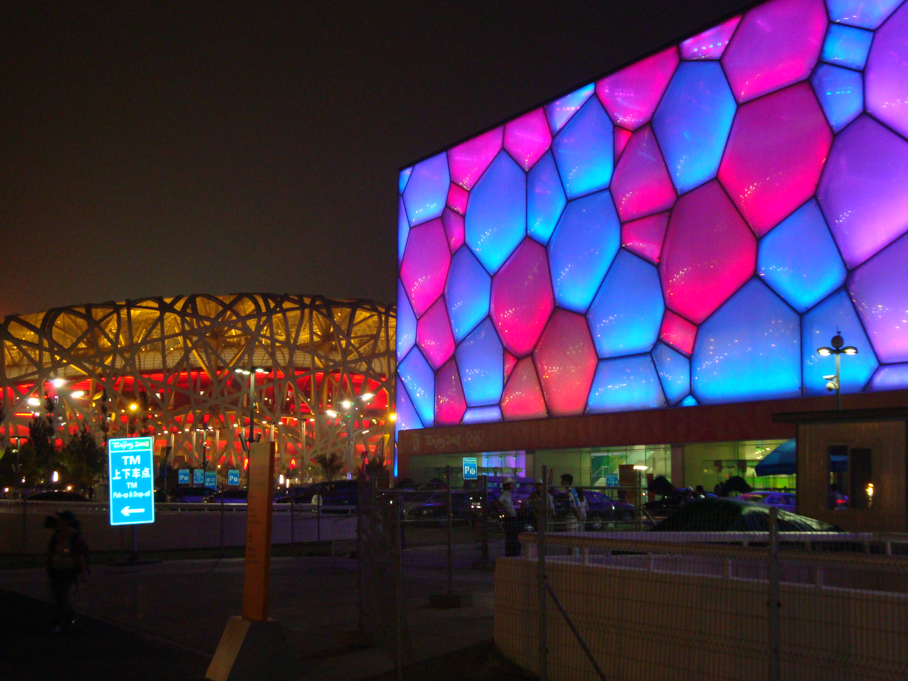

This project is a fascinating journey into the realm of Computational Fabrication. In this project, I research the intricate world where nature meets human innovation. I first dive into examples from the botanical and zoological world, then take a look at sophisticated structures created by organisms all with the goal of discovering how computational principles are ever present in the world today. I then expand this exploration into man made environments in order to find computational designs throughout the world. Finally I detail a few researchers/artists of computational fabrication who I find interesting, and I'm keeping my eye on.

# 1. Computational Design in Nature

## Botanical World
In the botanical world, few things are as illustrate both the beauty of nature and computation as a cabbage. When searching for an example of computational design in the botanical world, I came across the cabbage and it is easy to see how it is a great intersection between nature and math. 

The fibonacci Sequence, a sequence of numbers made by adding the previous two number together to get your next number is on full display in the cross section of a cabbage. A cabbage's leaves either grows clockwise or counterclockwise, and in different proportions that closely resemble the fibonacci sequence in a spiral. The patterns of the cabbage and the math you can see within it is why my eyes where drawn to it when looking for computation in botany. 

## Zoological World
To me, the giraffe is a perfect example of computation among animals. The spots on the giraffe was formed as a way of survival and blending in with the environment, but it is interesting to see the clear pattern among the spots with the winding path of white that encloses the somewhat circle orange and brown shapes. Among my research into the spots on the giraffe, I came across the turing process which is a mathematical model that describes how self-regulating patterns arise in organisms. The giraffe is a great example of the turing process.

## Environment Built by Organisms
Zoanthid is the most interesting animal I have never heard of before throughout this project. They are beautiful, colorful, and show defenite signs of computation among how the coral forms. In the picture of the coral there is clearly a pattern of colors that change as they come out from a single point and a ring of vibrant tentacles that forms a circle at the edges of each arm. 

# 2. Computational Design in the Human-made Built Environment

## Buga Fibre Pavilion
Though I could not find any available picture to use of the Buga Fibre Pavilion located in Germany, it is a great example of computational design in a man made structure. The structure was created by the University of Stuttgart and the inspiration for the design came from the wings of a beetle. Not only was the structure designed with computation, but it also used two filament winding robots to build the Pavilion. It is an interesting example of an architectural piece that used computational design.

## Water Cube Beijing
The Water Cube located in Beijing is a massive aquatic center that used computational design in order to make the massive display wrapping around the outside of the building. As you can see from the image of the building it almost looks like scales of a fish, but the people who built the building used Plateau’s geometry of soap bubbles in order to come up with the design, and used CAD to model the structure. Seeing what is possible in the world of computational design and fabrication through this piece gets me excited to learn more on this journey.

## Coral Cup
The coral cup is an example of computational design that combines both the man made products and the design from the natural world. The cup was designed by Nervous System, a company that designs products throough computational design. Though again I don't have a picture for this example, the coral cup uses the algorithmic design of a brain coral to etch grooves into the porcelean cup. To me, this is a great example of something smaller that can be made through computational design.

# 3. Researchers/Artists of Computational Fabrication

## Jessica Rosenkrantz
Jessica Rosenkrantz is the co-founder of Nervous System, a company that creates products through generative design and digital fabrication. The reason I chose her as someone to follow within the computational fabrication industry is because as of right now the work she does seems to most interesting and fun compared to others. An example of the work is a generative jigsaw puzzle that they sell on their companies website. The puzzle uses generative design to create the piecies, and uses a laser cutter to cut them out of wood. As someone who loves board games, this work seems the most like something I will be able to do and create at the end of this journey.

## Benjamin Dillenburger
Benjamin Dillenburger is a professor for Digital Building Technologies in Zurich. His research focuses on building technologies based on computational design, digital fabrication, new materials, and he searches for ways to exploit the potential of addiditve manufacturing for construction. The reason I was drawn to him as a researcher was because of a certain project they had worked on. The project dealt with using marble quarry waste in 3D printing. 40% of the marble quarries production located in Ticino was rock flour, and they set out on a path of helping relieve the waste problem that the quarries encountered. This appealed to me because I am very interested in finding ways that digital fabrication can help the environment, or eliminate waste. Last summer I worked on a startup the explored solutions to waste management, and finding ways to use waste that would have been thrown out otherwise. So, this type of research is very interesting to me.

# Challenges Faced
Though this project was only research releated, there where still some problems that I faced. For starters, the most frustrating problem is finding images for examples that I can use in my blog without any copyright infringment, but that wasn't that big or worrying of a problem. the other problem that I faced was with finding researchers/artists that I connected with and know I could return to as I continue to learn about computational fabrication. There is a lot going on in the world of computational fabrication, but it can sometime be hard to find researchers/artists that are working on things that seem attaiable at my current level, and exciting. Overall though, this project was a great way for me to learn about the many forms of computation and fabrication throughout or world.

# Work Cited
“Arzo - 3D Printing with Waste from Marble Quarries.” Digital Building Technologies, 2023, dbt.arch.ethz.ch/project/arzo/. 

“Benjamin Dillenburger.” Digital Building Technologies, 14 Jan. 2021, dbt.arch.ethz.ch/team-member/professor-benjamin-dillenburger/. 

Carfrae, Tristram. “Engineering the Water Cube.” ArchitectureAU, 1 July 2006, architectureau.com/articles/practice-23/. 

Giesbrecht, Kirsten. “The Turing Process: Math Reveals How the Leopard Got Their Spots and How Molars Get Their Shape.” The Pipettepen, 4 Aug. 2022, www.thepipettepen.com/the-turing-process-math-reveals-how-the-leopard-got-their-spots-and-how-molars-get-their-shape/#:~:text=have%20in%20common%3F-,Their%20surface%20patterns%2C%20from%20the%20patches%20on%20giraffe%20coats%20to,regulating%20patterns%20arise%20in%20organisms. 

Lisa. “Fibonacci Numbers in Nature.” The Smart Happy Project, 3 Aug. 2013, thesmarthappyproject.com/fibonacci-numbers-in-nature/. 

“Nervous System: Shop: Coral Cup.” Nervous System | Shop | Coral Cup, n-e-r-v-o-u-s.com/shop/product.php?code=367. Accessed 28 Jan. 2024. 

Sabina Aouf , Rima. “University of Stuttgart Creates Biomimetic Pavilions Based on Sea Urchins and Beetle Wings.” Dezeen, 8 May 2019, www.dezeen.com/2019/05/08/university-stuttgart-biomimetic-pavilion-bundesgartenschau-horticultural-show/. 
