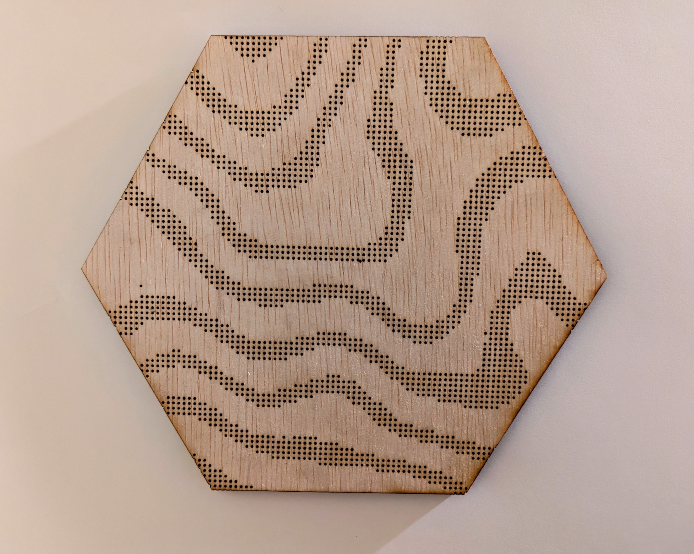
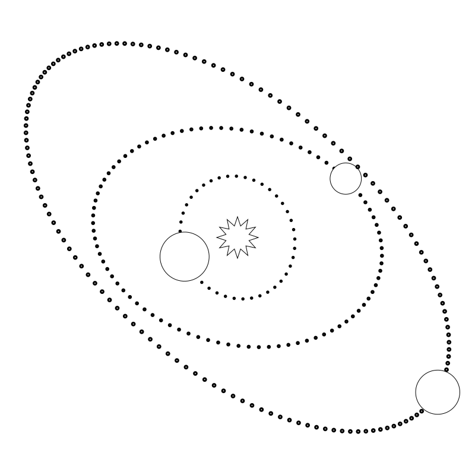
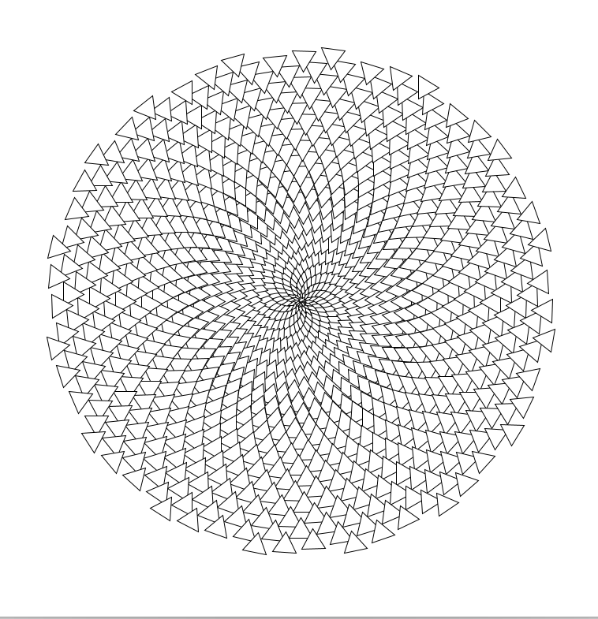

This project showcases my first effort in creating computational designs, and fabricating them with a laser cutter/engraver. I first took three inspirations: the solar system, topographic map designs, and spiral designs. From there I studied the math and computation behind how these patterns show up in the real world and used that to create closely related and generated designs using Processing 4. To finish it all off I used Rhino and a laser cutter/engraver to make these designs a reality by engraving and cutting them out on pieces of plywood. This blog details my process, and the results of my work.

# Materials Used
### Software & Machines
- **Processing 4:** Used to generate the computational designs.
- **Rhino Software:** Utilized for refining designs and for preparing files for laser cutting.

- **Laser Engraver:** Employed laser cutter from BTU (Blow Things Up) Lab at the University of Colorado Boulder to fabricate generated designs.

### Physical Materials
- **Handprint 1/4" x 12" x 12" Birch Plywood:** Chosen for its durability and suitability for laser cutting. Provides an aesthetically pleasing base for designs.

# Design 1: Topographic Map Design
This design I took heavy inspiration from topographic map designs that you see on things like mousepades. I always thought those designs looked cool, and I knew using loops it would be acheivable. The first thing I had to do for this design was figure out how I was going to acheive it. Eventually I found myself using the nosie funciton available in processing. The idea was to have multiple elevation levels that the program would check for, and at each elevation level it would go through almost every coordinate in the window to check if the noise value at that coordinate either matched or closely matched the eleveation we where checking for at the current level. If it did, the program would draw a point there. 

In the end the end result shows a design that is very similar to what topographic map designs look like, if not a little more rough. I think the most interesting thing however is that at the end of making this design, it kind of looks more like the stripes on a zebra rather than contour lines of a topographic map.

This design I fabricated in the BTU Lab as my first fabrication. After uploading the design as a svg to Rhino, creating a hexagon border to cut out, and 25 minutes in the laser cutter, the designed was finished, and you can find the results of it below.

### Mathematical Calculations
**Noise Function for Elevation Generation**
- Utilized the perlin noise function in Processing to simulate natural terrain elevations.
- scaled noise values to control ruggedness of terrain.
- iterated over most coordinates on grid using noise values to determine elevation at each point.
- mapped elevations to different levels which .created contour lines that resemble topographic maps.

**Threshold Mapping**
- Used 'map' function in Processing to convert elevation levels from a range of 1 - numLevels into a range of 0 - 1.
- This normalization allowed for consistent interpretation of noise levels as elevation levels

### Output

### Code

# Design 2: Generated Solar System
This design, I took inspiration on the solar system. This design required a lot more math than the other two as I implemented many random variables to create a random solar system with a star in the center. The random variables I considered included: random planet sizes, random orbit eccentricity, random orbit rotation, and a random for each planet to be on for its orbit. This part took a while to figure out all the math behind creating orbits and ensuring that the planets would lie on a point around their orbit. You can see the math calculations I needed to consider below.

I decided to also laser cut this design. I decided that for this one, I would cut out the planets and engrave the orbits of the planets to have an interesting design in my opinion. This one only took about 8 minutes in the machine as it didn't have as much dots to engrave, and I was pleasently suprised by the result as you can see below.

### Mathematical Calculations
**Orbital Mechanics**
- Defined elliptical orbits using two parameters: semi-major axis and eccentricity.
- Semi-major axis determined the size of the orbit, while eccentricity defined its shape, ranging from circular to highly elliptical.

**Planetary Positioning**
- Calculated the position of each planet on its orbit using polar coordinates.
- The angle array determined each planet's position along the orbit path.
- Used trigonometric functions to convert polar coordinates to Cartesian coordinates.

**Orbit Rotation**
- Applied a rotation to each orbit for added visual diversity.
- This rotation was applied to the coordinate system, altering the orientation of the elliptical orbits.

### Output

### Code

 
    

# Design 3: Spiral of Triangles: 
This is probably the simplest design that I created for this project, and as such I decided not to fabricate it in the BTU Lab. The idea behind this desing was to just make a simple but cool pattern using loops, and I landed on the idea of creating a spiral since I thought that it would look the best for the project at hand. I took inspiration and got some help with the math behind this design from Daniel Shiffman and his Learning Processing book which had a spiral example that is similar to mine. To code this spiral all you really need to do is start from the center, and with each iteration increase the angle and radius so that a spiral is formed. Further details into the math are below, and if you want to see the design, it will be down there as well.

### Mathematical Calculations
**Spiral Formation**
- Utilized polar coordinates to define spiral path.
- Incrementally increased the radiusand angle to move along the spiral.
- Each step moved slightly outward and rotated a fixed angle to create the spiral effect.

**Triangle Placement**
- Placed triangles along the spiral path.
- Calculated the vertices of each triangle relative to the current point.
- Used trigonometric calculations to position each vertex of the triangles.

### Output

### Code

 

# Challenges Faced
Throughout this project there where obviously a lot of challenges that where faced with it being my first time
trying to laser cut anything. Because of that, I would say that most of my problems did come from trying to laser cut
and engrave.

The first major problem I found has to do with using points in processing and trying to import a file that used points
into Rhino. Working on my topographic map design, I found that when you try to upload a file that used points to Rhino,
Rhino wouldn't read the points, and they wouldn't show up. Luckily though, it was a pretty easy fix, and all I had to do was edit
the processing code to create small ellipses instead of points.

The second problem I faced throughout this proejct had to do with laser cutting itself. With both of my fabricated designs, if you look
hard enough, you may be able to tall that everything on them is actually cut out, and not engraved. The goal was to have all the dots on
both the solar system, and topographic map to be engraved while everything else would be cut out. I believe that although the planets and 
outline shapes where set to hairline so that they would cut all the way through, the thickness of the material or depth of cut wasn't properly set for the dots.

The last problem I faced in this project had to do with learning about perlin noise. For my first design, I used perlin noise to help map out the topographic elevation lines for the design. This to me took a while to wrap my head around and learn about how each time the program runs the noise function loads a random seed that basically maps an infinite noise field, assigning values between 0 and 1 to each coordinate point.

# Conclusion
In the end, this project was incredibly fun, especially when it came time to create our design with the laser cutter and engraver. Now that I have a grasp on what noise is, and how it works within processing, I want to find a way to use it for future designs as we get into L-Systems. I learned a lot in this mini project, and became comfortable with the laser machines in the BTU Lab, and feel ready to take my next step in learning about computational fabrication.

# Work Cited
Kuluum. “Processing: Perlin’s Noise Applying.” Medium, Medium, 15 Mar. 2020, medium.com/@kuluum/drawing-wobbly-bobbly-lava-ball-21577ab6d559. 
Shiffman, Daniel. “Spiral.” Spiral | Learning Processing 2nd Edition, Morgan Kaufmann, 20 Aug. 2015,
    learningprocessing.com/exercises/chp13/exercise-13-05-spiral. 
Vanga, Manohar. “Getting Creative with Perlin Noise Fields.” Sighack, 2 Jan. 2018, sighack.com/post/getting-creative-with-perlin-noise-fields. 