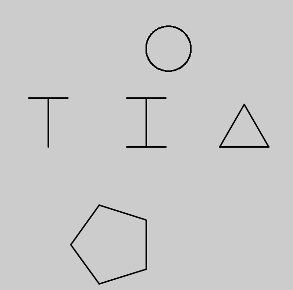
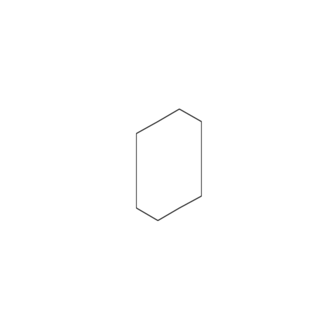
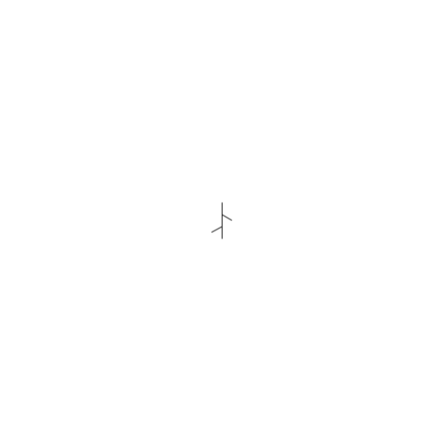
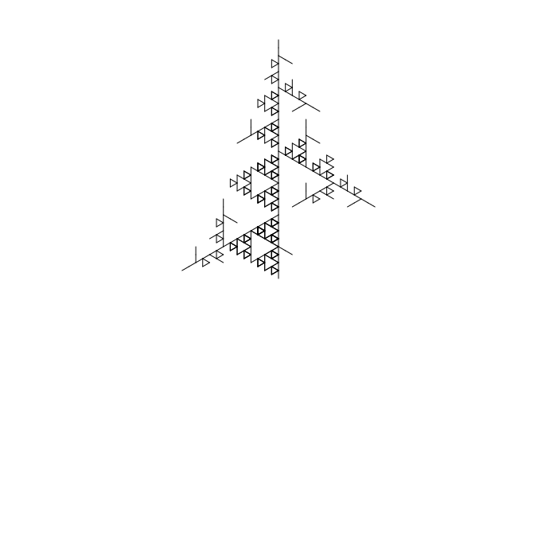
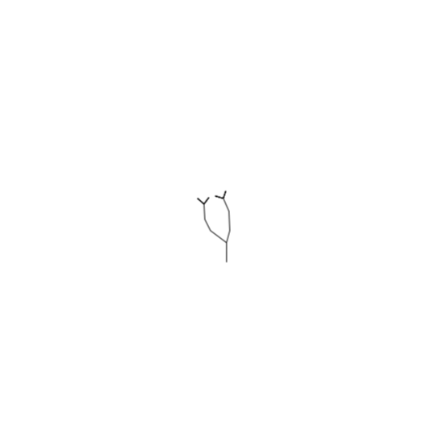

This project walks you through my thought processes and progress as I learned how to code L-Systems using Turtle in Processing 4. I gradually progressed into the unique L-systems I created (shown later in blog), but I started by learning the basics of turtle by creating simple shapes and letters using turtle commands. I then learned about the outline of L-systems by creating an example L-System which slingshotted me forward into creating 3 unique L-System designs, one being a inspired by how trees grow in nature, while the others are unique creations after spending lots of time messing with variables and taking inspiration from other famous L-System curves. After creating these designs I again took my knowledge from my previous blog to the laser cutter to engrave my favorite two designs. This blog will show my work and process just like past blogs.

# Materials Used
### Software & Machines
- **Processing 4:** Used to generate the computational designs.
    - **Turtle Library:** I used the Leah Buechley Turtle library for this project
- **Rhino Software:** Utilized for refining designs and for preparing files for laser cutting.

- **Laser Engraver:** Employed laser cutter from BTU (Blow Things Up) Lab at the University of Colorado Boulder to fabricate generated designs.

### Physical Materials
- **Handprint 1/4" x 12" x 12" Birch Plywood:** Chosen for its durability and suitability for laser cutting. Provides an aesthetically pleasing base for designs.

# Part 1: Learning Turtle
For the first stage of learning about L-Systems, I first got acquainted with the Turtle library by Leah Buechley. Turtle uses a bunch of basic commands such as: forward, back, left, right, penUp, and penDown to help the turtle draw on the canvas. For this first stage, I was tasked with creating the letter I and T, a triangle, a pentagon, and finally a circle. After understanding how turtle moves, this step was very simple and I just had to make sure that I used penUp and penDown properly so I didn't draw unwanted lines. The math I used to help create the circle and penagon in described below.

### Mathematical Calculations
**Calculating the internal angles of a shape**
- Used 180 - (((sides - 2) / sides) * 180) to calculate internal angle dependent on number of sides.
    - This was used to help draw the pentagon (5 sides) and circle (360 sides).

### Output

### Code

# Part 2: Implementing L-System Framework
For the second stage, I learned about what goes into the framework for a L-System. Most of the framework here was provided to me, with some missing holes to be filled in as I went. The result of filling in the missing chunks of the framework was a fractal L-System that grew with each iteration starting as a simple square. This part will showcase the fractal, and the work I put into completing the framework.

### Mathematical Calculations
Details on some of the math, and code I produced for this part of my project.

**Iterating L-System**
- Implemented loop to iterate over L-System a number of times equal to 'numIterations'.

**Applying Production Rules**
- Checked for corresponding rule in HashMap and appended the result to 'currentIterationBuffer' if rule existed for character.

**Drawing L-System with Turtle Graphics**
- used given switch-case structure to define operations based on characters such as '+' rotating left by certain angle.
### Output

### Code
This code below details the code I added to the framework in order to fill in the missing pieces.

# Part 3: My Unique L-Systems

## L-System 1: Interesting Pattern
For two of these L-Systems I created I ended up taking the approach of messing with variables and different rules until I landed on something that looks cool. This is very much one of those patterns. The idea of this pattern was to start with an axiom that already has a completed shape so that as the L-System grows, so does the shape. Overall, it was pretty simple and only included forward and turning operations for the turtle, but the result in my opinion looks really cool and I laser cutted it out aswell.

### Mathematical Calculations
**L-System Inputs**
- 'moveDist' variable measuring distance turtle moves each forward step set at *50 units*
- 'rotateAngle' variable measuring angle by which turtle rotates each step set at *60 degrees*
- 'scaleFactor' variable which scales drawing up or down set at *0.6 units*

**Rule Definitions**
- F -> "F+f-FF+F+FF" and f -> "f+ff+f"

### Output

### Code
This code shows you the vocab, axiom, rules, and operations I used in order to create this L-System.

## L-System 2: Branching Tree (Sierpinski Triangle)
This is the second of the L-Systems that I created that I also just messed around with vocabulary and axioms in order to find a cool design. The whole point of this design was to take inspiration from an incredibly interesting well known L-System the Sierpinski Triangle and merge it with branching of trees. Overall the product of this L-System is really cool. 

I should preface this and say that right after I made this L-System I fabricated it and cut it out but didn't save the Processing file detailing how I was able to create it. I spent hours trying to recreate it with no luck, so you will see the final product, but the workings of how I coded it are instead my closest replication.

### Mathematical Calculations
**L-System Inputs**
- 'moveDist' variable measuring distance turtle moves each forward step set at *30 units*
- 'rotateAngle' variable measuring angle by which turtle rotates each step set at *120 degrees*
- 'scaleFactor' variable which scales drawing up or down set at *1 units*

**Rule Definitions**
- F -> "F[+F]F[-F][F]" 

### Output

### Code

## L-System 3: Branches & Petals
This is the one L-System that I created for this project that I put thought into how I can create a realistic looking plant that branches upwards. I felt that in order to accomplish this I needed to introduce some probability when it comes to angles at which the turtle turns and length at which the turtle moves to help it look a little more natural. If I did this again I would defenitely consider using more probabilty with different rule sets so that there is more variability and the product can look more unique. You can see the final product below with its petals and branches.

### Mathematical Calculations
**L-System Inputs**
- 'moveDist' variable measuring distance turtle moves each forward step set at *20 units*
- 'rotateAngle' variable measuring angle by which turtle rotates each step set at *25 degrees*
- 'scaleFactor' variable which scales drawing up or down set at *.5 units*

**Rule Definitions**
- F -> "FF+[+F-F-F]-[-F+F+F]" 

**Noise and Randomness**
- Noise offset: for the turning angles of the turtle, I used noise offset that increased with each use to make the angle at which the branches moved random, but more subtle than a random function.
- Random distance: I used the random function in order to make the length of each branch different and more unique.

**Draw Leaf**
- Used drawLeaf(Turtle t) function in order to create little leaves that can be placed at the end of each branch. Can see code in code section.

### Output

### Code

# Challenges Faced
Throughout this project there where a could of problems that I faced. One small problem I face had do do with laser cutting at the BTU. The sizes are very deceptive and acidentally cut the first pattern L-System out too big, and thus it has a little chunk missing on the border.

The bigger challenge I faced in this problem has to do with not saving my Processing File. After laser cutting out both of my designs, I returned to processing to see that all of my progress was gone. I was able to recreate one L-System, and spent hours on the other without any luck.