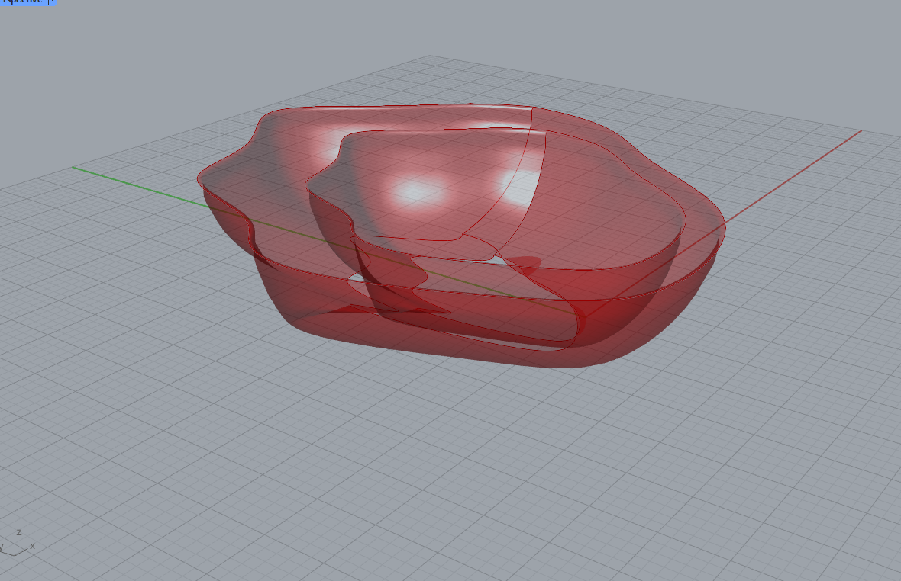
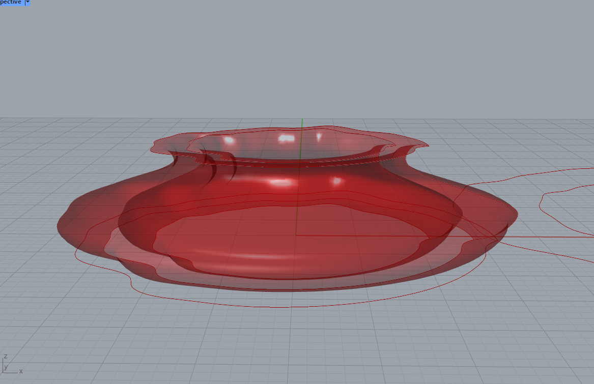
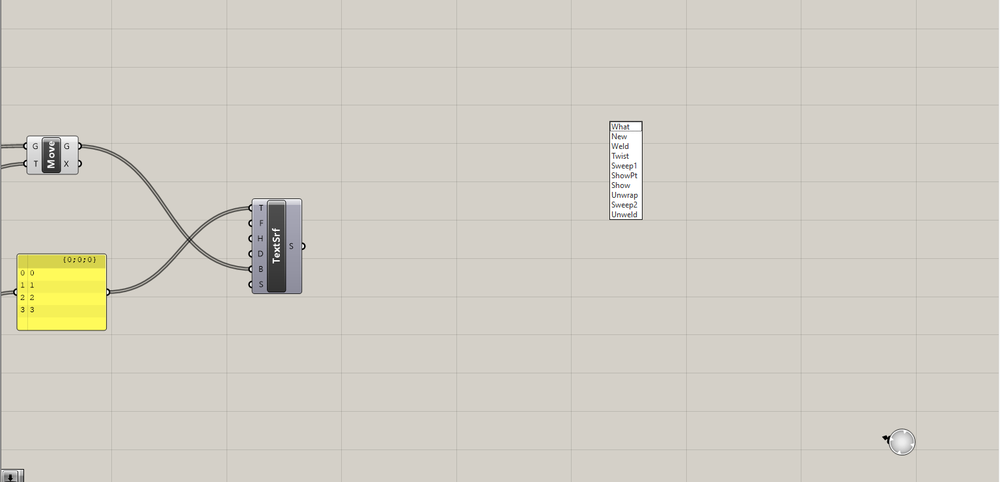

This project takes our learning from creating 2D generated designs with processing to creating 3D generated designs with Rhino and Grasshopper. Through this project I importantly learned how to use Grasshopper to create unique 3D generated objects like a pencil holder, a bowl, and I also learned how to create my own 3D to 2D slicer in order to continue fabricating these 3D designs with a laser cutter. After creating the designs and cutting out slices on a laser cutter I stacked the layers ontop of eachother to recreate my unique 3D design. This blog will run through each step of the project as I did, showcase the many variations in my Grasshopper design, the slicer I created, and the fabricated results of the project.

# Materials Used
### Software & Machines
- **Rhino 8:** Utilized in conjunction with grasshopper to great 3D designs, and a 3D to 2D slicer. Program also used in order to print to laser cutter.
    - **Grasshopper:** Visual programming language and environment within Rhino 8, used to generate unique 3D designs.

- **Laser Engraver:** Employed laser cutter from BTU (Blow Things Up) Lab at the University of Colorado Boulder to fabricate generated designs.

### Physical Materials
- **Handprint 1/4" x 12" x 12" Birch Plywood:** Chosen for its durability and suitability for laser cutting. Provides an aesthetically pleasing base for designs.
- **Gorilla Glue:** Used to glue the sliced pieces together.

# Part 1: Parametric 3D Designs
In this first part of the project, my goal was to be able to create a script with at least 10 parameters that I can change and mess with in order to create a 3D object with different forms and appearances. The script I created is shown below and holds 10 parameters (also explained below) that when changed affects the design in ways such as changing the height, radius of circles, shape of design, and so on. For this design I was inspired by the natural wooden wall art designs by Joshua Abarbanel. With my project though, I focused a little bit more on functionality than rather than art I kept touches of the art though by using graph mappers in order to create interesting and natural designs for the objects.
### Mathematical Calculations
For this project I will break mathematical calculations into two categories: paramaters of the script, and non-parameters. You will be able to see the visual scripts further below under: *code*.

**Parameters**
1) *Height* - a slider ranging from 0 - 100 affecting the height of the object.
2) *Overall Object Shape* - a graph mapper that when changed will affect the overall form of the object. can turn the object into something that looks like a bowl or a vase and so on.
3) *Complexity of Points* - a slider that affects how many points are generated at each level, and thus affects how the shape looks.
4) *Width* - a number slider that is multiplies against the shape graph mapper. When value is higher, the wider the object is.
5) *Outline Shape* - a graph mapper that when changed will effect the shape of the slices at each level. Ex. when you have a noise graph instead of the object having slices that look like circles, the object will have deformed looking slices.
6) *Outline Complexity* - just like the other complexity parameter, this affects the complexity of each outline slices by determining how much points the program will divide the object into.
7) *Outline Steps* - the outline graph mapper has a domain from -1 to 1, this parameter when changed will affect how many steps the object will take a look at along the graph. The higher the steps, the more the object is affected by the graph mapper.
8) *Outline Intensity* - this is the paramater that is multiplied against the graph mapper meaning that when changed the higher the value the more intense and wide the outline shape will be.
9) *Scale X* - in order to make the object have actual thickness, this thickness coupled with the next parameter change how thick the object is going to be by scaling it along the X.
10) *Scale Y* - in order to make the object have actual thickness, this thickness coupled with the last parameter change how thick the object is going to be by scaling it along the Y.

**Non-Parameters**
- For this part, only used multiplication in order to scale the object with relation to the graph mapper.

### Output
Here I am going to showcase the parameters I used and the images of 5 different object variations using my Grasshopper script. I will list parameters from 1 to 10 representing the parameters above.
**Object 1 - Spikey Vase**
 

 

1) 7.386
2) Adjusted Bezier Graph
3) 2.992
4) 9.929
5) Sine Graph
6) 38.746
7) 15.487
8) 1.2
9) 1.2
10) 1.2

**Object 2 - Deformed Bowl**
 

 

1) 10.4
2) Adjusted Bezier Graph
3) 7.5
4) 16.3
5) Noise Graph
6) 13.5
7) 11.9
8) 18
9) 1.4
10) 1.4

**Object 3 - Normal Vase**
 

 

1) 11.8
2) Adjusted Bezier Graph
3) 9.3
4) 11.8
5) Horizontal Line
6) 15.6
7) 14.2
8) 0
9) 1.5
10) 1.38

**Object 4 - Mushroom Cloud/Table**
 

 

1) 6.4
2) Parabola Graph
3) 3
4) 22
5) Sine Graph
6) 38.7
7) 15.5
8) 1.2
9) 1.2
10) 1.2

**Object 5 - Sack/Santa's Bag**
 

 

1) 7.7
2) Sinc Graph
3) 6.6
4) 26.3
5) Sinc Graph
6) 38.7
7) 15.5
8) 5.5
9) 1.3
10) 1.2

### Code
This shows you the visual code from Grasshopper I used in order to create the above objects. The screenshots show the script setup for the object one output.
 

# Part 2: Creating a 3D to 2D Slicer
For this second stage I learned how to create my very own slicer that when it recieves the dimensions of a 3D object is able to create slices a number of slices through the object based on the objects height and thickness of cutting material. From their the slices are displayed on a 2D plane side by side and ready to be laser cut. In this section I show you the code for my slicer, the slices and fabrication for two of my created objects.

### Mathematical Calculations
The only mathematical calculation that my slicer does really is dividing the height of the object by the thickness of material you are working with in order to determine the number of slices necessary for laser cutting. 

### Output
**Spikey Vase Slices**
 

**Spikey Vase Fabrication**
 

**Deformed Bowl Slices**
 

**Deformed Bowl Fabrication**
 

### Code
The code below showcases the slicer script I used to create slices for the fabricated objects above. As a note in the script you see, the thickness parameter and object size are adjusted to be smaller than real life as to not lag my computer.
 

# Challenges Faced
This project I faced a lot of problems. Most of them coming with tuning and figuring out problems in Grasshopper. Lets go over a couple.

Earlier in this blog, I mentioned that the work I was trying to make my designs more functional over artistic, and as you may have noticed the designs may not seem very functional, and that is because of the problem I had with making a closed base for my objects. I tried multiple times to create a bowl in this project, but as I worked I found that when the graph mapper for the object form goes to 0,0 on the graph, I get errors stopping it from closing at the bottom. As such, none of the many things I tried worked, and I was forced to make my project more artisitic than functional.

Another problem I had throughout this project had to do with merging curves for the slicer. I found that no matter what I tried throughout the project I was not able to get the slicer to recognize and merge to curves on the same z plane. the result made it so that curves that where meant to be on the same slice appeared on different slices, and as a result you may have seen in the slicer code I had to put the same scaling code there as I used in my design script.

If I where to do this project again, I would take a different approach to making bowls and functional items so that it is easier to implement with a custom slicer and voide of many complex curves.