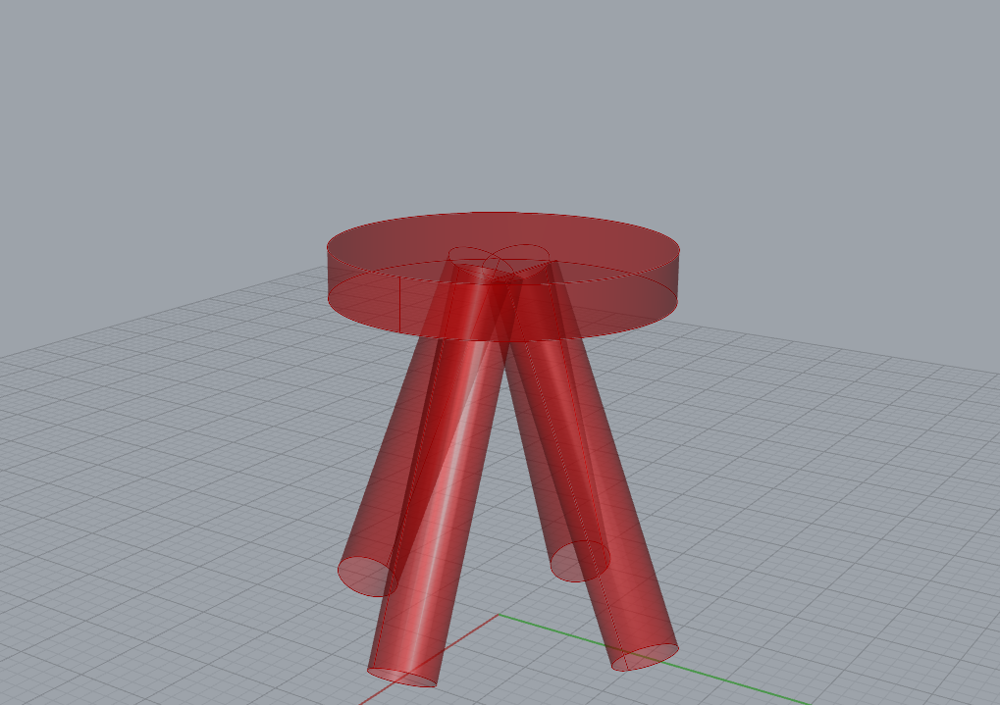
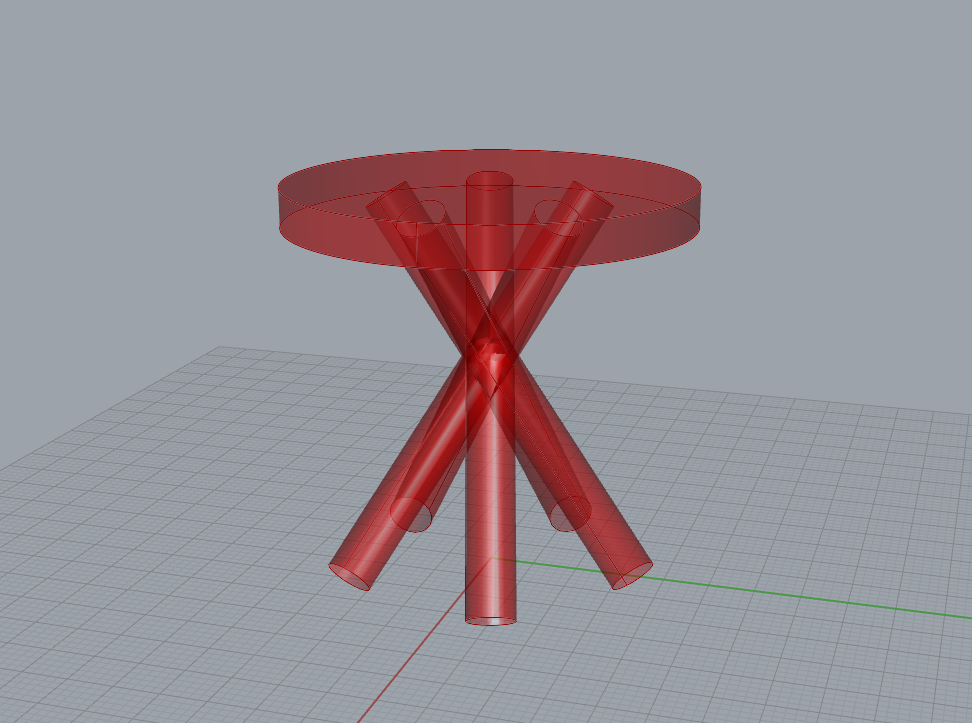
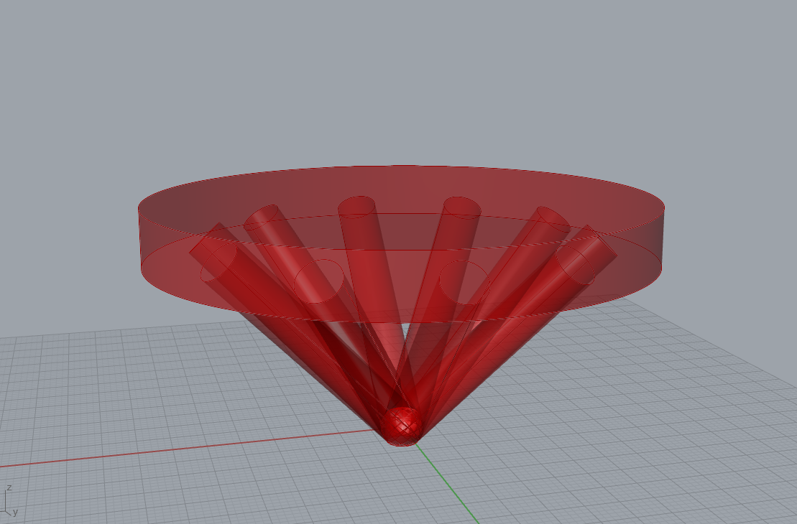
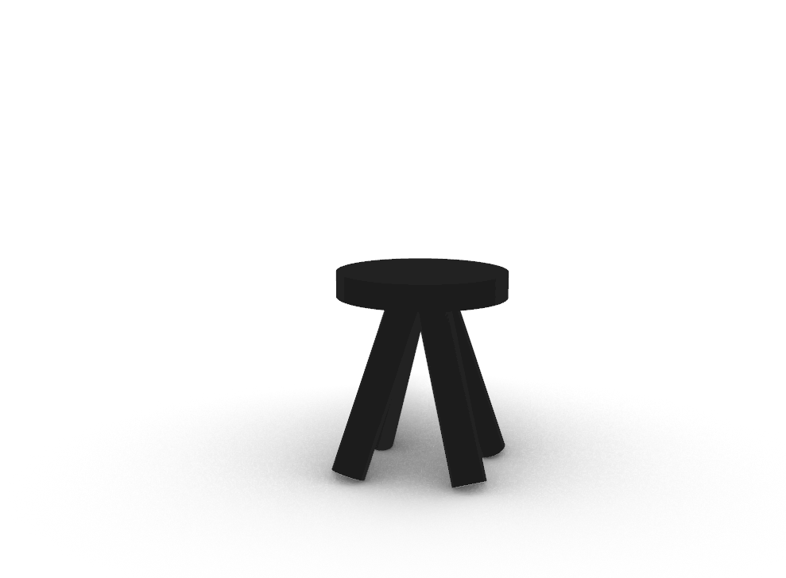
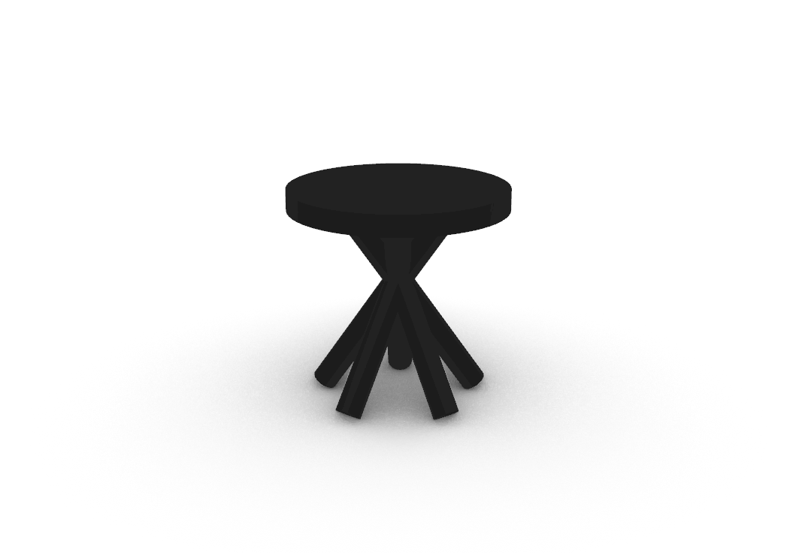

For this shorter project, I was introduced to 3D printing and creating parametric furniture within both Grasshopper and Rhino. I was able to create a script in Grasshopper that allowed be to make 3 different variations of a sitting stool with a seat and legs. After creating these variations, I used Prusa Slicer in order to get the furniture ready to be 3D printed with 3D printers from the BTU Lab here at CU Boulder. This blog showcases the script I made and the resulting fabrications of the furniture.

# Materials Used
### Software & Machines
- **Rhino 8:** Utilized in conjunction with grasshopper to great 3D designs, and a 3D to 2D slicer. Program also used in order to print to laser cutter.
    - **Grasshopper:** Visual programming language and environment within Rhino 8, used to generate unique 3D designs.

- **3D Printer:** Employed 3D printer from BTU (Blow Things Up) Lab at the University of Colorado Boulder to fabricate generated designs.

### Physical Materials
- **PLA Filament:** Used in the 3D printers in order to create the furniture.

# Part 1: Parametric Furniture Designs
In this first part of the project, my goal was to be able to create a script that when completed looked like a stool that could be sat on and when the parameters change, so does the look of the stool. The result of this was a very simple stool that you can expect to see in places like bars and restraunts, and three other variations of this. You will be able to see the three variations below, and the script I used to create them.
### Mathematical Calculations
For this project, the only mathematical calculations that I used where for the parameters of the stool. Here I will break down what those parameters are, and what they do.

**Parameters**
 

1) *Circle Radius* - a slider that changes the radius of the seat.
 

2) *Circle Extrusion Factor* - a slider that changes how thick the seat is. 
3) *Circle Z-Axis Movement Factor* - a slider that effects how far up seat should be on z-axis. 
4) *Stool Leg Radius* - a slider that changes radius of stool legs. 
5) *Stool Leg Extrusion Factor* - a slider that changes how thick the stool legs are. 
6) *Stool Leg Rotation Angle (Degrees)* - a slider that changes the angle at which stool legs are. 
7) *Stool Leg Y-Axis Movement Factor* - a slider that decides how far away stool legs should be fronm center. 
8) *Stool Legs Polar Array Angle* - a slider that changes how far stool legs go in a circle. 
9) *Number of Stool Legs* - a slider that changes how many stool legs there are. 

### Output
Here I am going to showcase the parameters I used and the images of the 3 different furniture variations using my Grasshopper script. I will list parameters from 1 to 9 representing the parameters above. 
**Object 1 - Standard Stool**
 

 

1) 10
 

2) 3
 

3) 20
 

4) 2
 

5) 23.315
 

6) 21.550
 

7) 10
 

8) 360
 

9) 4
 

**Object 2 - Nice Table**
 

 

1) 22.283
 

2) 4.301
 

3) 38.785
 

4) 2.650
 

5) 50
 

6) 34.555
 

7) 16.502
 

8) 360
 

9) 5
 

**Object 3 - Wierd Table**
 

 

1) 38.234
 

2) 8.765
 

3) 27.059
 

4) 3.294
 

5) 42.138
 

6) 45.079
 

7) 0
 

8) 360
 

9) 10
 

# Part 2: Furniture Fabrication

In this part of the project, I will showcase to you the fabricated images of the furniture I showcased.
Below you will see two picture showcasing the fabrication of furniture one and two from above using a 3D printer with Pursa Slicer.

### Mathematical Calculations
The only mathematical calculation that where required here where to make sure that the object fit into a 60mm x 60mm x 60mm field for the 3D printer.

### Output
**Object 1: Stool**

**Object 2: Table**

# Challenges Faced
After the last project, I felt a lot more confident and ready for this project and experimenting with Grasshopper, though I did run into one massive problem.

The one massive problem I ran into with this project had to do with the fabrication of the furniture and the snow storm we had during this project. Getting into the lab in order to fabricate these items when I planned to do it during the snow storm made this project a lot more stressful then it needed to be.