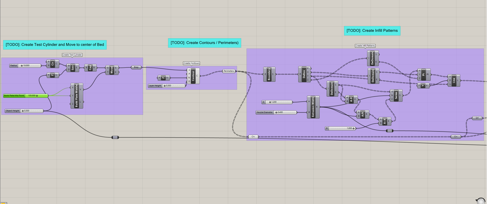

For this project, I continue my work with Grasshopper, Rhino, and 3D printing, while also introducing myself to python scripting within Grasshopper. The goal of this project is to take a simple 3D object such as a cylinder and then create a 3D slicer that can be used in 3D printing. This project is going to be divided into two different parts. The first part I am going to create the 3D slicer and create scripts for genereating infill in a rectilinear pattern, and for the creation of gcode. The second part will involve fabrication using 3D printers with my slicer after testing from part 1. This blog will my progress through the first part of the project with many screenshots and code samples.

# Materials Used
### Software & Machines
- **Rhino 8:** Utilized in conjunction with grasshopper to great 3D designs, and a 3D to 2D slicer. Program also used in order to print to laser cutter.
    - **Grasshopper:** Visual programming language and environment within Rhino 8, used to generate unique 3D designs.

- **BullAnt:** A Grasshopper plug-in that will reduce overlapping lines or lines along a straight direction to a single polyline using the *ggSimplifyPolyLine* component.
- **Pancake:** A Grasshopper plug-in to export created gcode with the use of Export Txt component.
- **Zupfe Gcode Viewer:** A website that was used to test teh validity of generated g-code.

# Part 1: Building A Slicer and G-code Generator for 3D Printing
In this first part of the project, my goal is to create a 3D slicer that will slice an object at various different levels and create infill for the object. I then plan on creating a script to generate G-code for 3D printing, and test that the G-code works. Below I will show my work through each of these steps.

## Step 1: Generating A Basic Slicer for 3D Printing

## Code

 

> **The script can be downloaded here:** <a href="https://drive.google.com/file/d/1cj2FNEih9dcDYyqoPzS1rcm4M8tcgfPY/view?usp=sharing">Script</a>

### Output
> The image below is the generated image from the single-layer slicer script test within Rhino 8.

> The image below is the generated image from the multi-layer slicer script test within Rhino 8.

## Step 2: Create a G-Code Generator in Python/GH

For this part of the project, with help from a code template, I edited a python script to generate g-code that can be used for 3D printing. Below I will show you the code I created.

### Code

> **This code is for the *gcode_move()* function**
 

 

> **This code is for the *generate_gcode()* function**
 

### Output
You will be able to find the generate G-code for both single-layer and multi-layer cylinder objects in the included G-code files below. If you want to take a look at the completed Grasshopper script for this, you can take a look at the images above.

## Step 3: Exporting and Validating G-Code

For this part of the project, I used the pancake plug-in from Grasshopper with two different tools to export and verify that the g-code I have generated will work in 3D printing. The two tools I used where: Zupfe Gcode Viewer, and a course Gcode Validator.

### Output
**Single Layer**
> **Here is the gcode file used for testing a single-layer cylinder:** <a href="https://drive.google.com/file/d/1SLW6oOrDlXM9rf6eXw_OvNdS4qN6bV63/view?usp=sharing">single-layer g-code file</a>
 
The image below shows the test result from the *course test* from my slicer with a single layer. All of the tests for this where passed.

**Multi Layer**
> **Here is the gcode file used for testing a multi-layer cylinder:** <a href="https://drive.google.com/file/d/1cv2x8Q5LsSLVjxyvIC_U7X83ilC3y_mh/view?usp=sharing">single-layer g-code file</a>
 
The image below shows the test result from the *course test* from my slicer with multiple layers. All of the tests for this where passed.

The image below shows the test result from *Zupfe* from my slicer with multiple layers. The g-code worked.

# Challenges Faced
After the last project, I felt a lot more confident and ready for this project and experimenting with Grasshopper, though I did run into one massive problem.

The one massive problem I ran into with this project had to do with the fabrication of the furniture and the snow storm we had during this project. Getting into the lab in order to fabricate these items when I planned to do it during the snow storm made this project a lot more stressful then it needed to be.