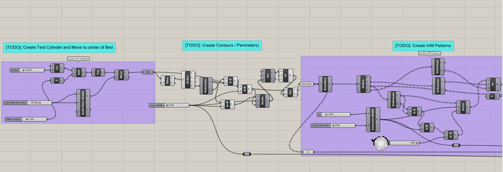

For this project, I continue my work with Grasshopper, Rhino, and 3D printing, while also introducing myself to python scripting within Grasshopper. The goal of this project is to take a simple 3D object such as a cylinder and then create a 3D slicer that can be used in 3D printing. This project is going to be divided into two different parts. The first part I am going to create the 3D slicer and create scripts for genereating infill in a rectilinear pattern, and for the creation of gcode. The second part will involve fabrication using 3D printers with my slicer after testing from part 1. This blog will my progress through the first part of the project with many screenshots and code samples.

# Materials Used
### Software & Machines
- **Rhino 8:** Utilized in conjunction with grasshopper to great 3D designs, and a 3D to 2D slicer. Program also used in order to print to laser cutter.
    - **Grasshopper:** Visual programming language and environment within Rhino 8, used to generate unique 3D designs.

- **BullAnt:** A Grasshopper plug-in that will reduce overlapping lines or lines along a straight direction to a single polyline using the *ggSimplifyPolyLine* component.
- **Pancake:** A Grasshopper plug-in to export created gcode with the use of Export Txt component.
- **Zupfe Gcode Viewer:** A website that was used to test teh validity of generated g-code.

- **Prusa Slicer** Program used to slice test cylinder and generate g-code
- **MK3S+ 3D Printer** Used this printer located in the BTU (Blow Things Up) lab at CU Boulder for fabrication.

# Part 1: Building A Slicer and G-code Generator for 3D Printing
In this first part of the project, my goal is to create a 3D slicer that will slice an object at various different levels and create infill for the object. I then plan on creating a script to generate G-code for 3D printing, and test that the G-code works. Below I will show my work through each of these steps.

## Step 1: Generating A Basic Slicer for 3D Printing

## Code

 

> **The script can be downloaded here:** <a href="https://drive.google.com/file/d/1xUYY1VIC1qeWy7Dw4JgOK2UIQ7tbaoAj/view?usp=sharing">Script</a>

### Output
> The image below is the generated image from the single-layer slicer script test within Rhino 8.
 

 

> The image below is the generated image from the multi-layer slicer script test within Rhino 8.

## Step 2: Create a G-Code Generator in Python/GH

For this part of the project, with help from a code template, I edited a python script to generate g-code that can be used for 3D printing. Below I will show you the code I created.

### Code

> **This code is for the *gcode_move()* function**
 

 

> **This code is for the *generate_gcode()* function**
 

### Output
You will be able to find the generate G-code for both single-layer and multi-layer cylinder objects in the included G-code files below. If you want to take a look at the completed Grasshopper script for this, you can take a look at the images above.

## Step 3: Exporting and Validating G-Code

For this part of the project, I used the pancake plug-in from Grasshopper with two different tools to export and verify that the g-code I have generated will work in 3D printing. The two tools I used where: Zupfe Gcode Viewer, and a course Gcode Validator.

### Output
**Single Layer**
> **Here is the gcode file used for testing a single-layer cylinder:** <a href="https://drive.google.com/file/d/1aic69Tthtbc16thT-vhNINLJboqLjQnQ/view?usp=sharing">single-layer g-code file</a>
 
The image below shows the test result from the *course test* from my slicer with a single layer. All of the tests for this where passed.
 

**Multi Layer**
> **Here is the gcode file used for testing a multi-layer cylinder:** <a href="https://drive.google.com/file/d/1NHurFUmZcgYSNQ7_wVoVkXvw3c4HfsqJ/view?usp=sharing">multi-layer g-code file</a>
 
The image below shows the test result from the *course test* from my slicer with multiple layers. All of the tests for this where passed.
  

The image below shows the test result from *Zupfe* from my slicer with multiple layers. The g-code worked.
 

# Part 2: Fabrication

## Pursa Slicer Test Cylinder
In this part of the project, I used a given STL file for a test cylinder and Prusa slicer to generate g-code for the cylinder to be 3D printed as a comparison for my own slicer. in Prusa, the settings I used where:
- *Print Settings:* .30mm DRAFT
- *Filament:* Generic PLA
- *Printer:* Original Prusa i3 MK3S & MK3S+

> **Here is the gcode file generated from Prusa Slicer:** <a href="https://drive.google.com/file/d/1SLW6oOrDlXM9rf6eXw_OvNdS4qN6bV63/view?usp=sharing">Prusa g-code file</a>
 
> The image below is the Prusa Slicer image for the cylinder
 

 
> The image below is the fabricated cylinder using the Prusa generated g-code
 

## Created Slicer and Cylinder
In this part of the project, I used the Grasshopper script I created in the earlier part with a *10 radius* and *1.5 mm height* cylinder parameter to generate g-code that I used with a MK3S+ Prusa 3D printer in order to fabricate the cylinder.

> **You can find the g-code file that I used for this part above under the *multi-layer* section of the output**

> The image below is the fabricated cylinder using the Grasshopper script and g-code I created
 

### Comparison
After fabircation of the two cylinders, I noticed a couple of things that where different between the two.
- The first and most obvious thing I noticed was the ammount of time it took each to fabricate.
    - The *Prusa Slicer* cylinder only took **two minutes** to fabricate
    - *My 3D Slicer* took **11 minutes** to fabricate the cylinder
    - If I had to guess this would be because my slicer is less optimized with the path it takes when filling in the infill of the object.
- Other than the timing of fabrication, the only other thing I can notice different between the two cylinders is the appearance.
    - As you can see in the images of the cylinders above, it appears that the *Prusa* cylinder has infill that is appears a little more dotted, and the color of the print is a little more uniform.
    - As you can also see in the images above, it appears that the cylinder from *my slicer* has infill that has more visibile lines, but the coloring of the cylinder top-down is darker on one side that the other.

# Challenges Faced
This project, I became a lot more familiar with using both Grasshopper, and 3D printing technologies. I was also able to use python scripting within Grasshopper for the first time, and this didn't come without any problems or issues.
 
I would say, the main problem I had with this project has to do with creating the infill lines. I spent a considerable amount of time trying to figure out how to get a rectilinear pattern to work despite all the resources given to me in order to figure it out. For whatever reason nothing was working and it just took enough trying to get it right.
 
Other than that though, the only other challenge I faced during this project was finding a way to remove the first layer of the cylinder while still ensuring that the g-code would pass all necessary tests.