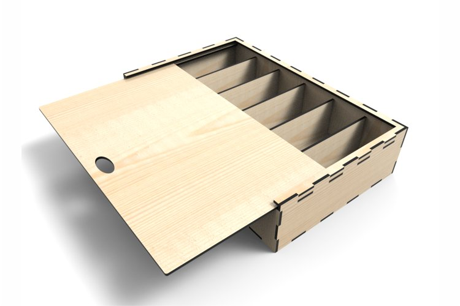
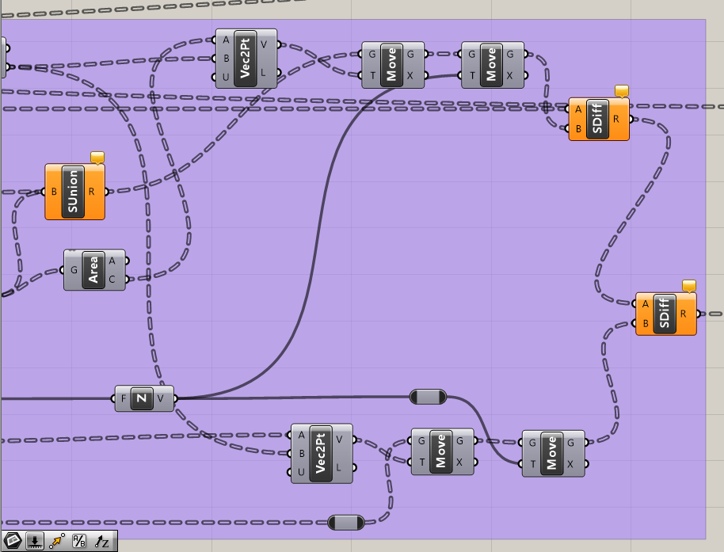
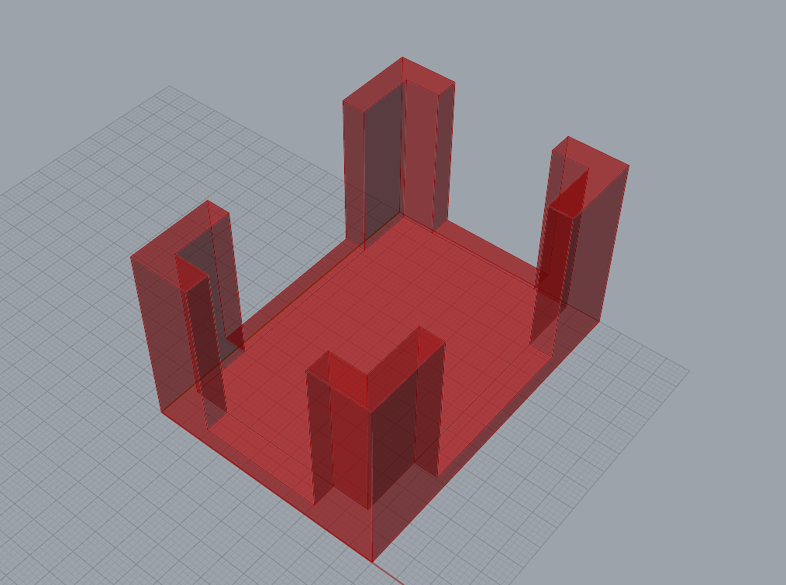
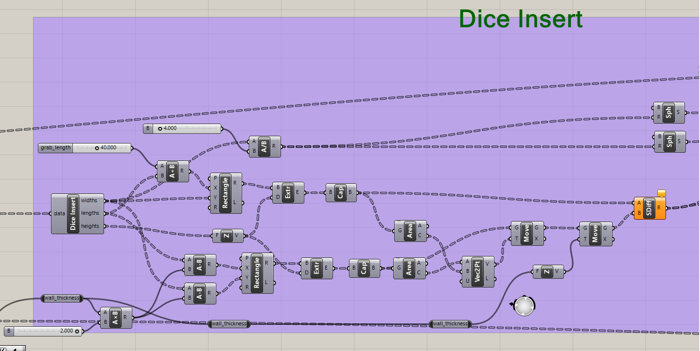
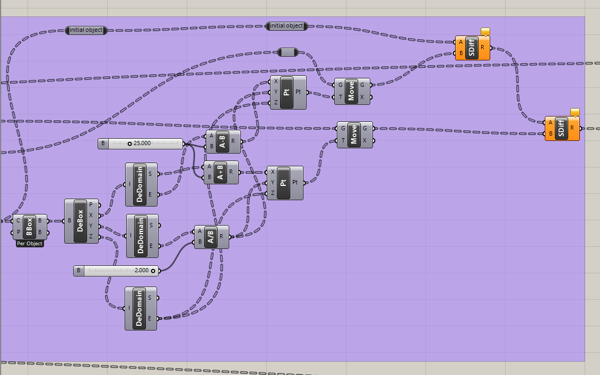
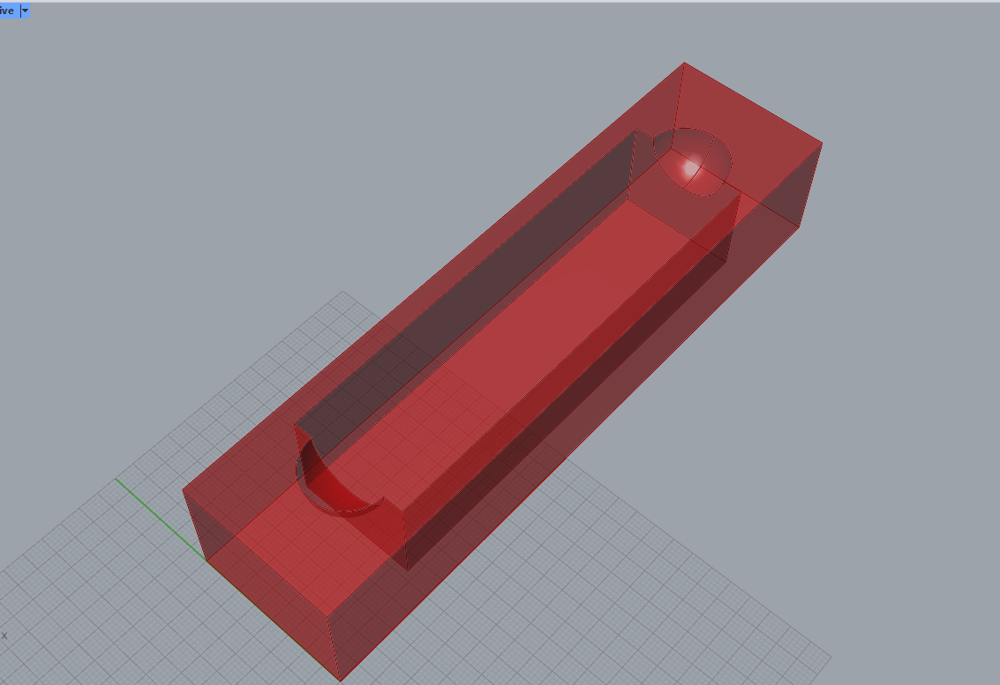
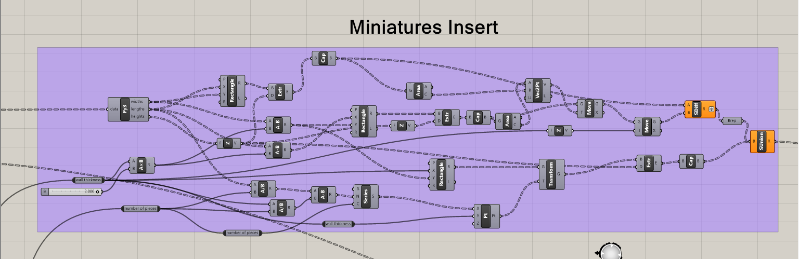
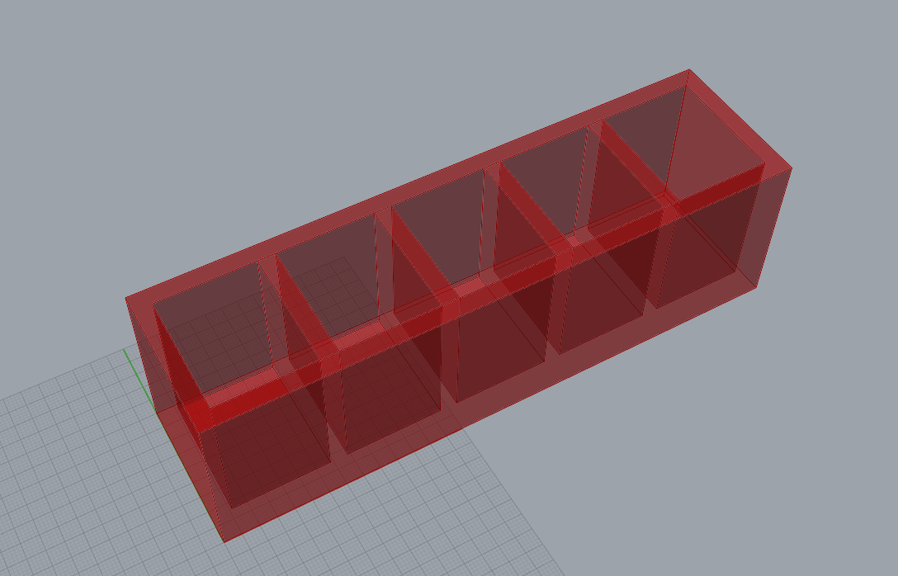

For this final project of my work through Computational Fabrication at CU Boulder I will continue to work with Grasshopper and Rhino 8 to make a script that can generate an entire board game box based on paramaters. The script will take in information about the type of inserts required, number of inserts, number of pieces, and then piece dimension in order to create unique inserts for different types of pieces. After creating the inserts required for the box, the script will run a bin staking alogrithm that will find the best possible orientation within a box for all the inserts. With all the inserts and box dimension figured out, the script will create a box to house the inserts with finger joints to connect the walls. In order to fabricate this project, I plan on using 3D printing for the inserts, and laser cutting for the box. Board games a passion of mine as I run a board game club at CU Boulder, so this project feels like a good combination of passion and challenge for me.

# Materials Used
### Software & Machines
- **Rhino 8:** Utilized in conjunction with grasshopper to great 3D designs, and a 3D to 2D slicer. Program also used in order to print to laser cutter.
    - **Grasshopper:** Visual programming language and environment within Rhino 8, used to generate unique 3D designs.

- **Prusa Slicer:** Program used to slice test cylinder and generate g-code.
- **MK3S+ 3D Printer:** Used this printer located in the BTU (Blow Things Up) lab at CU Boulder for fabrication of the inserts.
- **Laser Cutter:** Also utilized laser cutters located in the BTU (Blow Things Up) lab at CU Boulder for laser cutting the box.

### Fabrication Materials
- **PLA Filament:** The type of filament used with the MKS3+ Printer.
- **1/4" Thick Plywood:** The material used for laser cutting out the board game box.
- **Gorilla Glue:** Used to ensure board game box is constructed well.

# Part 1: Planning and Designs
For the first part of this project I am planning how I can achieve the vision that I layed out above. This part of the blog will show my thought process for what I am trying to achieve and what it will look like. Below you will see images of both what I expect the box to look like at the end of the project, and what I expect the different inserts to look like.

### Board Game Box

 
The image you see above is from a creator "Laser Bun" on a website called <a href = "https://designbundles.net/laser-bun/2044831-box-laser-cut-files-svg-cutting-files-dxf-cnc-cut-">designbundles.net</a>. This is what I am striving to do with the box that will encase the inserts for this project. This can be achieved through finger joinst as you can see from the project photo. You may notice the barrier slots in the photo of the box which uphold the lid from falling into the box. Because I am doing the project with inserts of different sizes with the goal of maximizing space efficienct, I can not have the same support structures for my box. To counteract this, I plan to make the box a little bit larger in its width in order to allow me to put two beam structures on either wall of the box to hold up the lid.

### Board Game Inserts

 
This image that you see above is the sketches I did to show you what I expect and want the each of the inserts to look like for the board game box. They are designed to fit each of the pieces snuggly to maximize space efficiency while also giving the user a way to easily retrieve whatever piece it is from the insert. that is why there are the half-sphere cutouts on the dice insert, missing walls of the card insert, and extra margin for the miniature insert.

# Part 2: Board Game Insert Script
In this part of the project I will start working with Grasshoper in Rhino 8 to create a script that will take in paramaters and then 3D model inserts that meet the requirements. The parameters include: *type of piece, width of piece, length of piece, height of piece, and quantity of piece*. The script is also made to take in a list of parameters so that it can produce multiple inserts at the same time as board games tend to have many inserts. below I will show you screenshots of the different insert models and give you a look at the code for this script.

## Code

> **For the rest of the blog you can refer to this Grasshopper script to follow along and see the code for yourself**
> **Link:** <a href = "https://drive.google.com/file/d/19Bqa8ikHb3OlG_DOdP8DfRCWjs0h71XL/view?usp=sharing"> Grasshopper Script</a>
 

This script as you can see from the code takes in all of the paramaters as a list and will then determine based on the entered type of piece the dimensions of the insert. Each insert is unique in how the size needs to be calculated. The card insert has cards that are going to be stacked on top of eachother which is why the height of the insert gets larger based on quantity. The dice inserts has each dice layed side by side so the length gets bigger on quantity, and finally the miniatures also are layed side by side so length gets bigger based on quantity, but it also has barriers that seperates the miniatures from eachother.
 
The only other python scripts we used in this project so far are for packing insert information into tuples and also a filter to ensure that the correct insert is built. Since these files are not very exciting or complicated/long I decided to leave them out, but you can still find them in the Grasshopper file.
 
## Output

>Here are screenshots of the script for each of the created inserts
### Card Insert
The parameters for this card insert where:
- type 1 insert
- 30 mm width
- 50 mm length
- 1 mm height
- 30 quantity
 

 

### Dice Insert
The parameters for this card insert where:
- type 2 insert
- 20 mm width
- 20 mm length
- 20 mm height
- 5 quantity
 

 

### Miniature Insert
The parameters for this card insert where:
- type 3 insert
- 25 mm width
- 25 mm length
- 40 mm height
- 5 quantity
 

  

### Basic Insert
The parameters for this card insert where:
- type 3 insert
- 25 mm width
- 25 mm length
- 40 mm height
- 5 quantity
 

